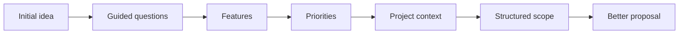

<div align="center">

# SCOPE

### Turn ambiguous project requests into structured scope before quoting.

**Define better. Quote with more clarity.**

[](https://nextjs.org/)
[](https://www.typescriptlang.org/)
[](https://tailwindcss.com/)
[](https://vercel.com/)

[Live Demo](https://scopebyfuentivo.vercel.app/) · [Fontesio](https://fontesio.vercel.app/es)

</div>

---

## The problem

A request like:

> “I need a system for my business.”

sounds simple, but it does not tell you enough to estimate:

- What needs to be built?
- Which features matter first?
- How complex is the workflow?
- What is actually required for version one?
- What can wait?
- What should the proposal include?

**Scope turns vague intent into an organized project definition.**

---

## The experience



Instead of starting with a blank document, the user progresses through a guided product flow.

---

## Core flow

```text
Onboarding
    ↓
Project type
    ↓
Progressive questions
    ↓
Feature selection
    ↓
Priorities
    ↓
Complexity context
    ↓
Time / budget orientation
    ↓
Dynamic summary
    ↓
Share / copy / print
```

---

## What the prototype explores

<table>
<tr>
<td width="50%" valign="top">

### Input

- Project context
- Guided questions
- Conditional steps
- Feature checklist
- Priorities
- Progressive completion
- User decisions

</td>
<td width="50%" valign="top">

### Output

- Structured summary
- Scope overview
- Feature organization
- Priority visibility
- Complexity orientation
- Time / budget orientation
- Shareable project snapshot

</td>
</tr>
</table>

---

## Product design decisions

### Progressive disclosure

The interface avoids dropping a giant requirements form on the user. Questions are revealed as the project becomes clearer.

### Local-first prototype

Scope intentionally uses local application state and `localStorage` instead of authentication or a production database.

That keeps the concept focused on **product flow**, not infrastructure.

### No fake commercial certainty

Any estimation logic is demonstrative and orientative. The product does **not** pretend to calculate a real final commercial quote from incomplete information.

### Shareable output

The result can be copied, printed or shared to make the transition from discovery to proposal easier.

---

## Stack

```text
Framework      Next.js
UI             React
Language       TypeScript
Styling        Tailwind CSS
Components     shadcn/ui
Motion         Motion
Icons          Lucide
State          React state
Persistence    localStorage
Logic          Pure estimation functions
Output         Print view · Web Share · Clipboard
Deployment     Vercel
```

---

## Visual direction

Scope uses a dark, product-oriented interface designed around focus and progressive decision-making.

```text
Base            #0F1720
Typography      Sora + Inter
Identity        Framing / corner motif with subtle “S”
Interaction     Controlled motion + progressive steps
```

---

## Why I built it

Scope explores a very real problem in software work:

> **Good delivery starts before the first line of code.**

A clearer input produces a clearer proposal, a clearer build and fewer avoidable misunderstandings.

---

## Status

**Concept product / demonstrative MVP · Published · 2026**

This project uses simulated/local data and is intentionally not presented as a production quoting engine.

> 🔒 The production methodology behind Fontesio projects remains private.

---

## Built by

**José Fuentes**  
Software Developer · Founder, **Fontesio**

[Live Demo](https://scopebyfuentivo.vercel.app/) · [Fontesio](https://fontesio.vercel.app/es)

<div align="center">

### Ambiguity in. Clarity out.

</div>
